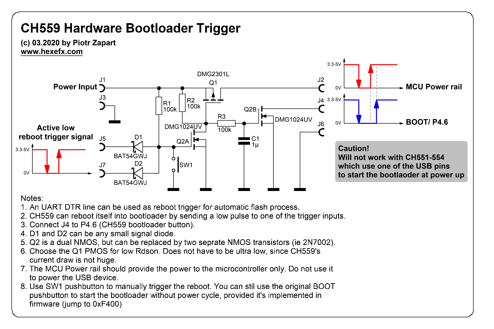
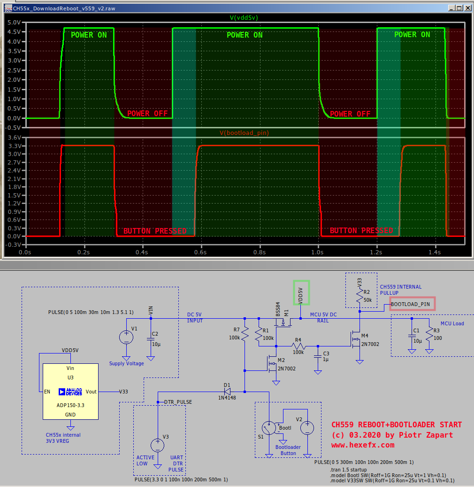
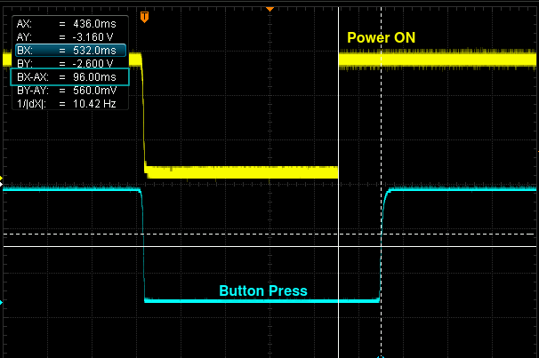

# CH55x-HW-reboot
Hardware reboot into bootloader for CH55x MCUs.
This circuit allows to cycle the power and boot up with the bootloader button pressed in order to get into bootloader mode.  
The reason for that approach insted of simpler way of jumping to bootloader address (0xF400 for CH559, 0x3800 for CH551-554) directly in the firmware is it seems the serial port part of the WCH bootloader (v.2.31) does not reply if there is no hardware reset detected.  
Another advantage is the reboot process can be externally triggered ie. by the UART DTR line, removing any need to manually start the bootloader if the flashing ois done via serial port. All operations can be automated by the python script.  
Python programming script for both USB and serial port can be found here:  

[CH55x_python_flasher](https://github.com/hexeguitar/CH55x_python_flasher)
___
### CH559 Version:
The bootloader button is on P4.6. The input is active low and pin is not 5V tolerant.  

Here is the distilled down version using one PMOS , one dual NMOS and a few passives:

Spice simulation:  

Hardware tests:  

___
(c) 03.2020 by Piotr Zapart  
www.hexefx.com
